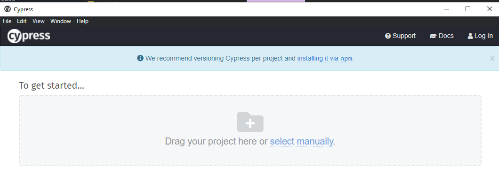
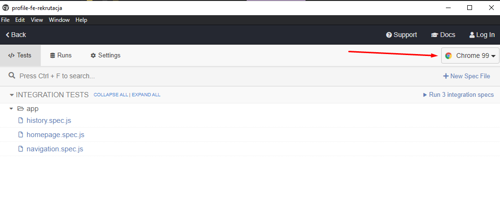
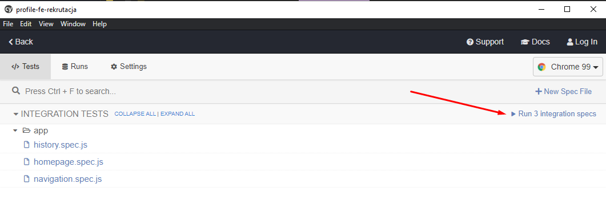

# Random user generator
This app is made for Profil Software internship recruitment.

*Made by Jerzy Szyjut*

Contact me via jerzy.szyjut@outlook.com

## Table of contents
- [Technologies](#technologies)
- [Prerequisites](#prerequisites)
- [Dependencies](#dependencies)
- [APIs](#apis)
- [Setup](#setup)
    - [Installing dependencies](#installing-dependencies)
    - [Running local HTTP Server](#running-local-http-server)
    - [SASS Compiling](#sass-compiling)
    - [Checking code style using ESLint](#checking-code-style-using-eslint)
- [E2E testing with Cypress](#e2e-testing-with-cypress)
- [Hooks (Husky)](#hooks-husky)
    - [pre-commit](#pre-commit)


## Technologies
- HTML
- JavaScript
- SASS
- ESLint
- Husky
- Cypress

## Prerequisites
Make sure you have installed all the following prerequisites before developing app.
- [Node >16](https://nodejs.org/)
- [git](https://git-scm.com/downloads)
- [Cypress](https://docs.cypress.io/guides/getting-started/installing-cypress#Direct-download)

## Dependencies
- [Fontawesome](https://fontawesome.com/) - Used for icons. Linked via [cdnjs](https://cdnjs.com/)
- [ESLint](https://eslint.org/) - Used to enforce code style and check code quality.
- [Husky](https://typicode.github.io/husky/#/) - Used for running git hooks.
- [Cypress](https://docs.cypress.io/guides/getting-started/installing-cypress#Direct-download) - Used for E2E Testing

## APIs
- [Random user](https://randomuser.me/) - free, open-source API for generating random user data.

## Setup
### Installing dependencies
```bash
npm i
```
### Running local HTTP Server
To run local HTTP server, first install `http-server` package
```bash
npm i -g http server
```
To start the server run this command in project root directory
```bash
http-server
```
### SASS Compiling
To watch SCSS files and compile them run
```bash
npm run sass
```
### Checking code style using ESLint
To check code style in project run
```bash
npm run lint
```

## E2E testing with Cypress
To start E2E testing, you need to download [Cypress](https://docs.cypress.io/guides/getting-started/installing-cypress#Direct-download).

You will need to change `"baseUrl"` to your local HTTP Server in [cypress.json](./cypress.json)

After unpacking Cypress files, open Cypress.exe and open project directory.


Choose your browser in the top right corner


Then press this button to run integration tests



## Hooks (Husky)
### pre-commit
Before every commit, ESLint checks code style
```bash
npm run lint
```
