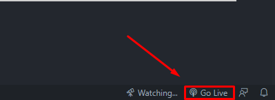
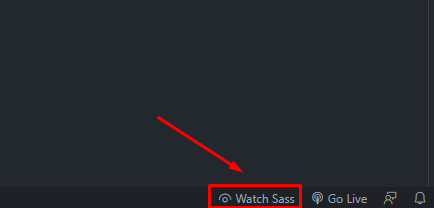

# Random user generator

## Table of contents
- [Technologies](#technologies)
- [Dependencies](#dependencies)
- [APIs](#apis)
- [Setup](#setup)
    - [Local hosting](#local-hosting)
    - [EditorConfig](#editorconfig)
    - [SASS](#sass-scss)

## Technologies
- HTML
- JavaScript
- SCSS
- EditorConfig

## Dependencies
- [Fontawesome](https://fontawesome.com/) - Used for icons. Linked via [cdnjs](https://cdnjs.com/)

## APIs
- [Random user](https://randomuser.me/) - free, open-source API for generating random user data.

## Setup
All setup is done for Visual Studio Code
### Local hosting
To run the app I used [Live Server extension](https://marketplace.visualstudio.com/items?itemName=ritwickdey.LiveServer).

To run app, using this extensions, you need to press "Go Live" button in the right bottom corner of the IDE.

### EditorConfig
To enforce settings written in .editorconfig you just need to install [EditorConfig extension](https://marketplace.visualstudio.com/items?itemName=EditorConfig.EditorConfig).
### SASS (SCSS)
For compiling SASS to CSS I used [Live Sass Compiler extension](https://marketplace.visualstudio.com/items?itemName=ritwickdey.live-sass).

To run compiler, using this extensions, you need to press "Watch Sass" button in the right bottom corner of the IDE.

